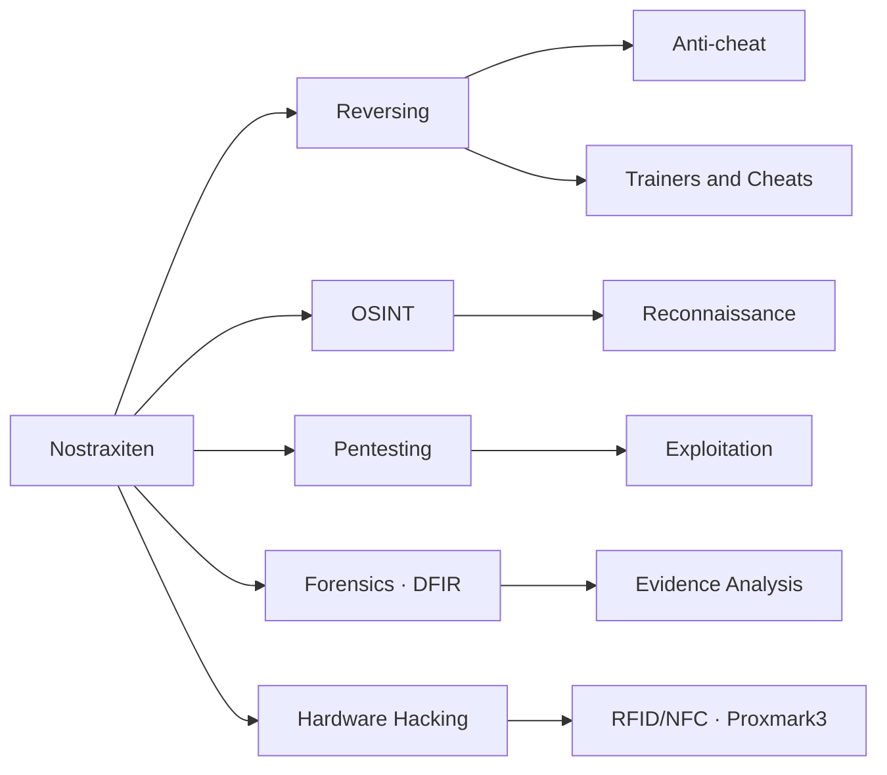

<!-- ╔══════════════════════════════════════════════════════════════╗
     ║   README · Nostraxiten — profile under constant development  ║
     ╚══════════════════════════════════════════════════════════════╝ -->

<!-- header wave -->

  

<!-- shields / badges row -->

  

  

  

<!-- security focus -->

  
   
  
   
  

## About Me

Studying with a focus on security: **pentesting**, **digital forensics**, and understanding how systems break from the inside out.

I am 100% adaptable: today it might be a game, tomorrow an exploit, and the day after that a physical device.

- Researching **reverse engineering**, **OSINT**, and **DFIR**
- Building my own security tools and frameworks

---

## What Interests Me

**Reverse Engineering** — Game reversing, internals, and low-level analysis

**OSINT** — Reconnaissance, data correlation, and digital investigation

**Cybersecurity** — Offensive/defensive security and digital forensics (`DFIR`)

**Hardware Hacking** — RFID/NFC with `Proxmark3`

**Development** — Security tools, discovery, and automation

## Stack & Tools

| Category | Technologies |
|-----------|-------------|
| **Systems** |     |
| **Languages** |          |
| **Reversing / RE** |     |
| **Networking / Pentest** |     |
| **Hardware** |  |
| **Environment** |       |

---

## Areas of Work

---

## Top Projects

**[cleaN](https://github.com/nostraxiten/cleaN)** &nbsp;
Open-source Windows system cleaner with preview-first safety, browser cleanup, unused app detection, and secure file deletion.

**[TerminuX](https://github.com/nostraxiten/TerminuX)** &nbsp;
Lightweight visual mod for Termux — dark theme, syntax-highlighted nano, and a Kali-style prompt showing your Wi-Fi IP and git branch. One-command install.

**[Root](https://github.com/nostraxiten/Root)** &nbsp;
Minecraft client build (mc 26.2, Fabric).

**[php-freebase](https://github.com/nostraxiten/php-freebase)** &nbsp;
Free, secure-by-default PHP starter base — admin panel, PDO with prepared statements, CSRF protection, and an empty MySQL schema ready to extend.

**[LookTheShark](https://github.com/nostraxiten/LookTheShark)** &nbsp;
Analyzes PCAP files to surface network activity, threats, sessions, and forensic findings fast.

**[kaisen](https://github.com/nostraxiten/kaisen)** &nbsp;
Port scanning and service enumeration tool with DNS resolution and extra options — my Rust learning project.

<strong>More on my profile</strong>

 

Beyond the highlights above, I keep a steady flow of smaller and in-progress projects — OSINT tooling, network scanning experiments, and the occasional game-related build. Everything's public, so take a look if you're curious.

---

  
     
---
     

> And well... if you enjoy this, it would help me a lot if you bought me a coffee.

  

  Studying to improve the profile

<!-- footer wave -->

  

