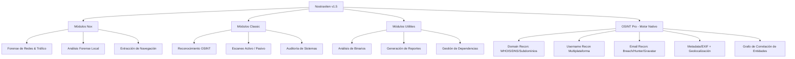

# Nostraxiten
> **Framework Modular de Auditoría de Seguridad, OSINT y Análisis Forense Digital**

[](https://www.python.org/)
[-lightgrey.svg?style=for-the-badge&logo=target)](https://github.com/Nostraxiten/nostraxiten)
[](https://github.com/Nostraxiten/nostraxiten/releases)
[](#)

---

## Descripción General

**Nostraxiten** es un framework de auditoría y análisis de seguridad de código abierto diseñado para centralizar y automatizar tareas esenciales de **OSINT**, **análisis forense digital (DFIR)**, **reconocimiento de red** y **diagnóstico de sistemas**. 

A través de una interfaz interactiva de consola (CLI) optimizada, Nostraxiten unifica potentes herramientas de la industria bajo un único entorno modular, permitiendo a analistas de seguridad, investigadores y entusiastas ejecutar auditorías complejas con facilidad.

> [!NOTE]
> **Actualización v1.5:** Se ha rediseñado por completo el núcleo del sistema, optimizando el rendimiento de la interfaz interactiva y potenciando el gestor multiplataforma de dependencias para una experiencia sin interrupciones.

---

## Interfaz del Sistema


---

## Arquitectura Modular y Capacidades

Nostraxiten organiza sus funciones en tres pilares principales, permitiendo una transición fluida entre distintas metodologías de investigación:



### 1. Módulos Nox (Análisis Profundo y DFIR)
*   **Forense de Redes:** Análisis y captura avanzada de tráfico utilizando `tshark` y `scapy`.
*   **Análisis Forense Local:** Adquisición y extracción de artefactos en memoria y disco duro con `volatility`, `foremost`, y `bulk_extractor`.
*   **Browser Forensics:** Detección de malware, extracción de historial, cookies, credenciales y perfiles de navegación local.
*   **Seguridad del Sistema:** Detección de rootkits y auditorías del sistema con `chkrootkit` y `lynis`.

### 2. Módulos Classic (OSINT & Auditoría de Redes)
*   **Reconocimiento OSINT:** Búsqueda pasiva de información y recolección de fuentes abiertas con `theHarvester`, `recon-ng` y `spiderfoot`.
*   **Escaneo e Inventariado:** Mapeo de puertos, servicios y vulnerabilidades mediante `nmap`.
*   **Auditoría Inalámbrica:** Utilidades y scripts para auditorías de redes WiFi locales.

### 3. Módulos Utilities (Herramientas y Diagnóstico)
*   **Análisis Binario:** Inspección preliminar de ejecutables y archivos sospechosos.
*   **Generador de Reportes:** Consolidación de hallazgos en reportes estructurados para su posterior análisis.
*   **Gestor Automático:** Instalación inteligente de dependencias del sistema y módulos de Python.

### 4. OSINT Pro — Motor Nativo (sin binarios externos)

A diferencia de los módulos `classic` (que orquestan herramientas externas), la suite **OSINT Pro** está implementada en Python puro y no requiere instalar binarios de terceros. Es el conjunto de módulos pensado para competir en profundidad con frameworks como SpiderFoot o Maltego:

*   **[27] Domain Recon:** Cliente WHOIS nativo (sockets), registros DNS completos, enumeración de subdominios vía Certificate Transparency (`crt.sh`) con resolución en paralelo, fingerprint HTTP/TLS y detección heurística de tecnologías (WordPress, Next.js, Cloudflare...), y barrido ligero de puertos comunes sin privilegios root.
*   **[28] Username Recon:** Búsqueda concurrente de un username en más de 80 plataformas (GitHub, redes sociales, foros, gaming, creativas...) usando una base de datos propia extensible en `data/osint_sites.json` — no depende de `sherlock-project`.
*   **[29] Email Recon:** Validación de sintaxis y MX, comprobación de Gravatar, verificación e enriquecimiento vía Hunter.io, y comprobación de brechas de datos vía HaveIBeenPwned.
*   **[30] Metadata / EXIF Analyzer:** Extracción de metadatos y datos GPS embebidos en imágenes, con generación automática de enlace a Google Maps.
*   **[31] Investigación Completa:** Orquesta todos los módulos anteriores sobre un mismo caso y correlaciona los hallazgos (dominios, IPs, subdominios, usernames, perfiles, emails, brechas, ubicaciones GPS...) en un **grafo de entidades**, exportado como JSON, Graphviz DOT y una visualización HTML interactiva autocontenida.
*   **[32] Ver Grafo de Entidades:** Explora investigaciones anteriores y accede a sus grafos/reportes generados.

> Configura tus API keys (Hunter.io, HaveIBeenPwned, VirusTotal, Onyphe, Shodan) desde la opción **[98] Config API Keys** del menú principal — sin ellas, los módulos que las usan degradan de forma controlada e informan qué falta.

---

## Requisitos del Sistema

*   **Entorno de Ejecución:** Python 3.8 o superior.
*   **Permisos:** Privilegios de administrador (Windows) o `sudo`/root (Linux/Termux) para instalar herramientas del sistema y gestionar adaptadores de red.
*   **Conexión a Internet:** Requerida para la instalación inicial de dependencias y consultas OSINT.

---

## Guía de Instalación

Nostraxiten incluye un **instalador inteligente automatizado (Opción `99`)** que configura los requisitos de Python y detecta las dependencias faltantes del sistema operativo.

### 1. Clonar el repositorio y acceder
```bash
git clone https://github.com/Nostraxiten/nostraxiten.git
cd nostraxiten
```

### 2. Configuración por Plataforma

Selecciona tu sistema operativo para realizar la instalación (automática o manual):

#### Windows (PowerShell)
> [!TIP]
> Ejecuta la consola como **Administrador** para garantizar la correcta configuración de las herramientas del sistema.

*   **Método Recomendado (Instalador Integrado):**
    ```powershell
    python nostraxiten.py
    # Selecciona la opción 99 en el menú interactivo para instalar dependencias automáticamente.
    ```
*   **Método Manual (Dependencias y Python):**
    ```powershell
    python -m pip install --upgrade pip
    python -m pip install requests colorama cryptography pycryptodome scapy pywin32
    ```
    *Descarga e instala manualmente los siguientes binarios agregándolos a tu PATH:*
    *   [Nmap](https://nmap.org/download.html) (Escaneo de red)
    *   [Wireshark / TShark](https://www.wireshark.org/) (Análisis de paquetes)
    *   [Exiftool](https://exiftool.org/) (Metadatos)
    *   [Steghide](https://github.com/StefanoDeVuono/steghide) (Esteganografía)

---

#### Linux (Debian/Ubuntu)
*   **Método Recomendado (Instalador Integrado):**
    ```bash
    python3 nostraxiten.py
    # Selecciona la opción 99 en el menú interactivo.
    ```
*   **Método Manual (Paquetes APT & PIP):**
    ```bash
    sudo apt update
    sudo apt install -y python3 python3-pip git nmap curl wget tshark binwalk exiftool steghide foremost bulk-extractor chkrootkit lynis
    python3 -m pip install --upgrade pip
    python3 -m pip install requests colorama cryptography pycryptodome scapy
    ```

---

#### Android (Termux)
*   **Método Recomendado (Instalador Integrado):**
    ```bash
    python3 nostraxiten.py
    # Selecciona la opción 99 en el menú interactivo.
    ```
*   **Método Manual:**
    ```bash
    pkg update && pkg upgrade -y
    pkg install python git nmap curl wget binwalk exiftool steghide foremost -y
    python3 -m pip install --upgrade pip
    python3 -m pip install requests colorama cryptography pycryptodome scapy
    ```

---

## Modo de Uso

Para arrancar el entorno interactivo de Nostraxiten:

```bash
python nostraxiten.py
```

### Navegación en el Menú
1.  **Exploración:** El menú principal agrupa las herramientas de manera categórica.
2.  **Ejecución:** Introduce el número del módulo que desees lanzar y sigue las instrucciones en pantalla.
3.  **Configuración de Módulos Propios:** Nostraxiten admite la ejecución de submódulos personalizados. La herramienta se encarga de estructurar automáticamente el `PYTHONPATH` para evitar conflictos de importación de librerías.
4.  **Actualización/Dependencias:** Introduce `99` en cualquier momento para comprobar e instalar las dependencias necesarias de tu sistema operativo actual.

---

## Estructura del Repositorio

La arquitectura del framework está estructurada para ser fácilmente extensible:

```text
nostraxiten/
├── nostraxiten.py           # Script principal y orquestador del menú
├── modules/                 # Directorio de módulos funcionales
│   ├── nox/                 # Módulos de análisis profundo y forense (DFIR)
│   │   ├── browser_forensics/
│   │   └── memory_analysis/
│   ├── classic/             # Wrappers de herramientas externas (nmap, tshark, sherlock...)
│   └── osint/               # OSINT Pro — motor nativo (domain/username/email/metadata + grafo)
├── data/                    # Datos estáticos (magic bytes, base de datos de plataformas OSINT)
├── config/                  # Configuración persistente (API keys, rutas, preferencias)
└── core/                    # Utilidades compartidas (colores, sesión HTTP, entorno, logging)
```

---

## Contribuciones y Desarrollo

¡Las contribuciones para expandir los módulos de Nostraxiten son siempre bienvenidas! 

Para añadir un nuevo módulo:
1.  Identifica la categoría adecuada de tu módulo (`nox` para DFIR y análisis profundo, o `classic` para OSINT y utilidades generales).
2.  Desarrolla el script integrando los manejadores de colores y salidas estandarizados en la carpeta `utils/`.
3.  Registra tu módulo en el menú interactivo de `nostraxiten.py` para asegurar que el framework configure el `PYTHONPATH` adecuadamente durante la llamada.

---

## Descargo de Responsabilidad (Disclaimer)

> [!WARNING]
> Este framework y sus módulos están diseñados exclusivamente con fines educativos, de investigación académica, auditorías de seguridad autorizadas y análisis forense bajo consentimiento legal explícito. El uso indebido de Nostraxiten para realizar actividades no autorizadas es responsabilidad exclusiva del usuario final. Los autores y contribuidores no se hacen responsables de los daños ocasionados por la mala utilización de esta herramienta.

