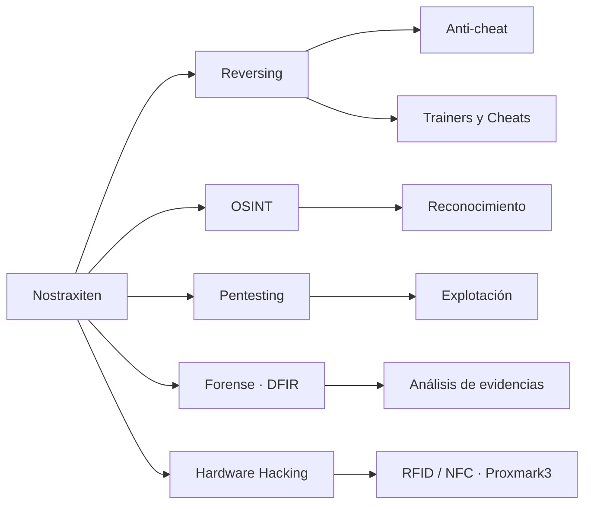

<!-- ╔══════════════════════════════════════════════════════════════╗
     ║   README · Nostraxiten — perfil en construcción constante 🛠️  ║
     ╚══════════════════════════════════════════════════════════════╝ -->

<!--   header wave -->

  

<!--   shields / badges row -->

  
  
  
  
  

<!--   security focus -->

  
   
  

---

## 🐱 Sobre mí

Estudiando con enfoque en seguridad: **pentesting**, **forense** y entender cómo se rompen los sistemas por dentro.
Soy 100% adaptativo: hoy puede tocar un juego, mañana un exploit, pasado un dispositivo físico.

-  Investigando **reversing**, **OSINT** y **DFIR**
-  Construyendo mis propias herramientas y frameworks

---

## 🔍 Lo que me atrae

**Reversing** — Hacks de videojuegos: cheats, trainers
**OSINT** — Reconocimiento, correlación de datos, investigación digital
**Ciberseguridad** — Ofensiva / defensiva y análisis forense digital (`DFIR`)
**Hardware hacking** — RFID/NFC con `Proxmark3` y otros aparatos reales
**Desarrollo** — Herramientas y frameworks propios, sin atarme a un lenguaje

---

## Stack &amp; Herramientas

| Categoría | Tecnologías |
|-----------|-------------|
| **Sistemas** |    |
| **Lenguajes** |      |
| **Reversing / RE** |     |
| **Red / Pentest** |     |
| **Hardware** |    |
| **Entorno** |     |

---

##  Áreas de trabajo

## 📂 Proyectos

<strong>Ver qué tipo de cosas puedes encontrar</strong>

 

Tengo una gran cantidad de proyectos en proceso y algunos ya terminados. Curiosos cuanto menos...

Alguno puede ser un `Grabber de IP`, otros pueden ser `OSINT avanzado`, otros pueden ser `escaneo o análisis de red`, o un `cliente de cheats` para un juego...

Todo queda en mis repositorios. *(Te invito a explorarlos)* 💗

---

##  Dónde encontrarme

  
  

---

> Y bueno... si disfrutas esto tanto como yo... me ayudaría mucho si me invitas a un café ☕

  

  Perfil en constante construcción 🛠️

<!--   footer wave -->

  

